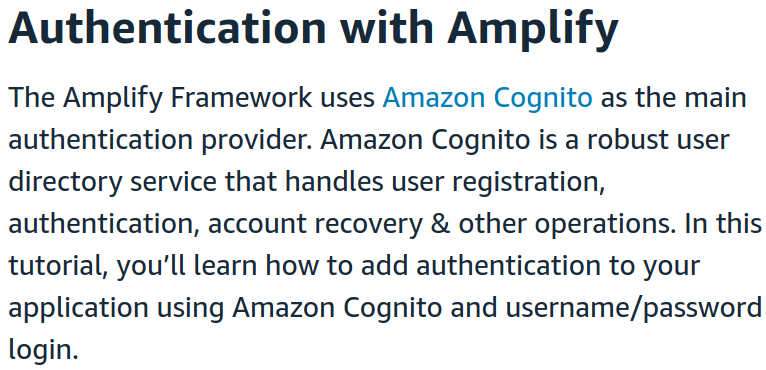
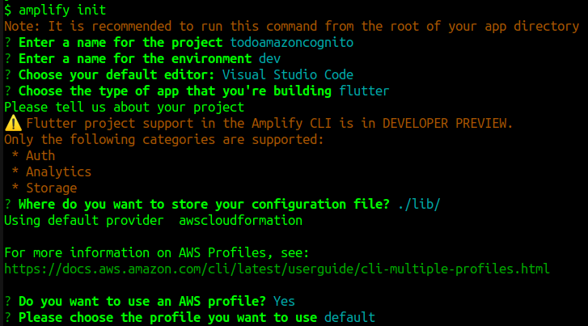
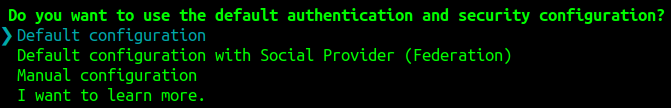
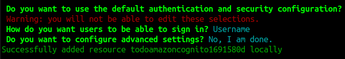
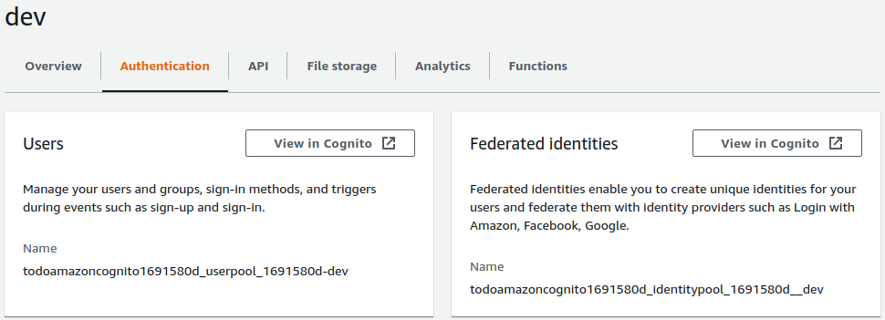
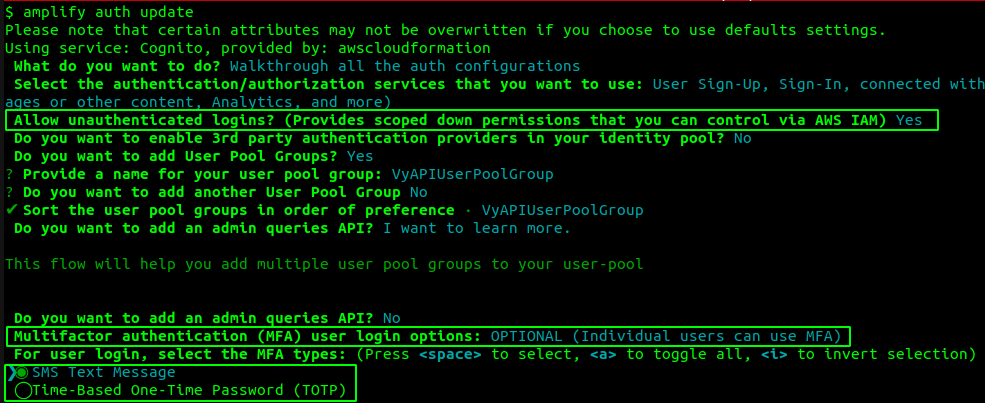

# The Changing Face of Mobile App Security

## OWASP Mobile Top 10 (2016)

* M1: Improper Platform Usage
* M2: Insecure Data Storage
* M3: Insecure Communication
* M4: Insecure Authentication
* M5: Insufficient Cryptography
* M6: Insecure Authorization
* M7: Client Code Quality
* M8: Code Tampering
* M9: Reverse Engineering
* M10: Extraneous Functionality

### M1: Improper Platform Usage

Misuse of Touch ID, the Keychain, Android intents, platform permissions, or other security features that are a part of the mobile operating system

### M3: Insecure Communication

### M4: Insecure Authentication - Obsolete?

Paradigm Shift: **Security Misconfiguration**

*"The Amplify Command Line Interface (CLI) is a unified toolchain to create AWS cloud services for your app."*

1. Initialize **AWS Amplify**

    
    
    

    Note: An empty **configuration file** is created locally.

2. Create an **authentication service**: `amplify add auth`

    

    

3. **Deploy** the authentication service: `amplify push`

    

4. View the deployed authentication service in **Amplify Console**

    
    

5. At this stage, make sure you understand the **user authentication security requirements** and then choose the desired configurations.

    

6. Also, check the contents of `amplifyconfiguration.dart` file. It now contains sensitive details associated with the deployed authentication service.

    

    **How would you protect this file?**

    

### M2: Insecure Data Storage - Obsolete?

Paradigm Shift: **Security Misconfiguration**

1. Create a storage service: `amplify add storage`

    

2. Make your choices consciously

    
    

3. Push local changes to the cloud: `amplify push`

    
    

### M5: Insufficient Cryptography

### M6: Insecure Authorization

git clone git@github.com:appsecco/VyAPI.git

### M7: Client Code Quality

### M8: Code Tampering

### M9: Reverse Engineering

### M10: Extraneous Functionality

## Exercise

1. 

# References

* https://github.com/riddhi-shree/knowledge-sharing/blob/master/Mobile/Android/environment_setup/setup_vyapi/README.md
* https://codifiedsecurity.com/owasp-mobile-top-10-2016-m1-improper-platform-usage/
* https://docs.amplify.aws/cli
* https://docs.amplify.aws/start/getting-started/auth/q/integration/react#create-authentication-service
* https://docs.amplify.aws/start/getting-started/add-api/q/integration/flutter#setup-aws-cloud-resources-with-amplify-cli
* https://github.com/aws-amplify/amplify-flutter