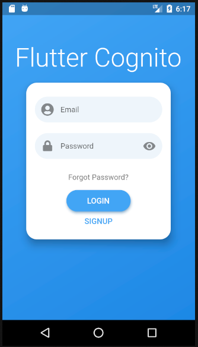
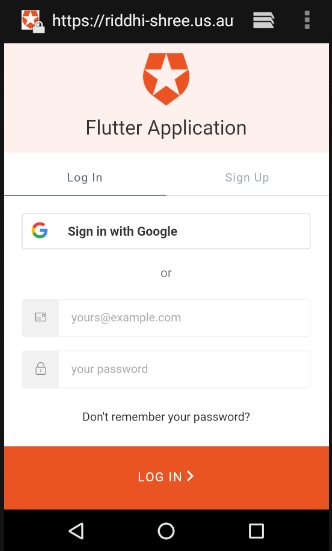
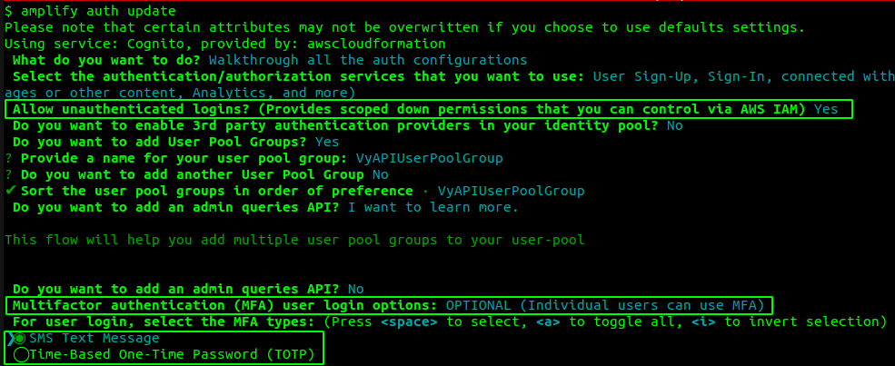
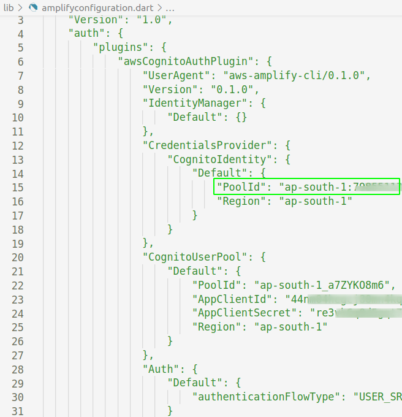

# M4: Insecure Authentication

>Paradigm Shift: **Security Misconfiguration**

## BEFORE: Build Everything

## AFTER: Plug-And-Play

* Flutter login UI with Amazon Cognito authentication and authorization services implementation

    

* Android (Java) app with Amazon Cognito hosted UI, authentication and authorization services implementation

    

* Flutter app with Auth0 authentication and authorization services implementation
  
    

## A Short Implementation Story

*"The Amplify Command Line Interface (CLI) is a unified toolchain to create AWS cloud services for your app."*

1. Initialize **AWS Amplify**

    
    
    

    Note: An empty **configuration file** is created locally.

2. Create an **authentication service**: `amplify add auth`

    

    

3. **Deploy** the authentication service: `amplify push`

    

4. View the deployed authentication service in **Amplify Console**

    
    

5. At this stage, make sure you understand the **user authentication security requirements** and then choose the desired configurations.

    

6. Also, check the contents of `amplifyconfiguration.dart` file. It now contains **sensitive details** associated with the deployed authentication service.

    

    **How will you protect the sensitive data stored in this file?**

    

    A plausible solution is to pass a JSONObject containing the configuration from the `awsconfiguration.dart` file at runtime.

    

## References

* https://docs.amplify.aws/sdk/auth/hosted-ui/q/platform/android
* [How to protect PoolId in awsconfiguration.json?](https://github.com/aws-amplify/aws-sdk-android/issues/711)
* https://aws-amplify.github.io/aws-sdk-android/docs/reference/com/amazonaws/mobile/config/AWSConfiguration.html