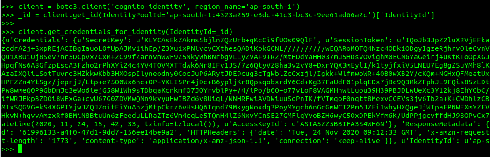
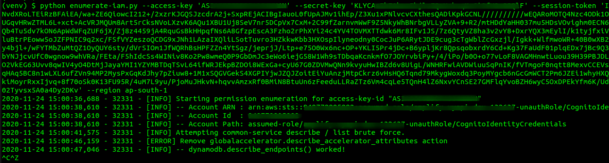
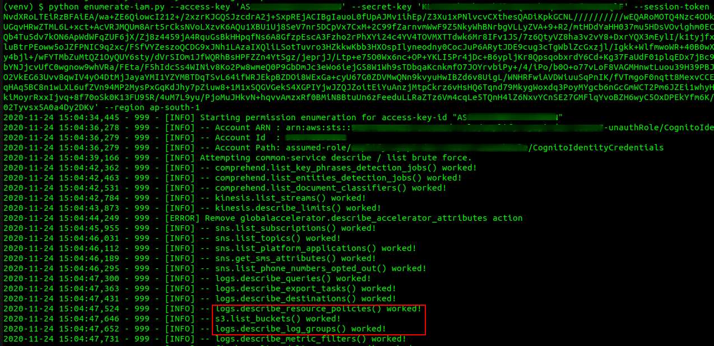

# M6: Insecure Authorization

>Paradigm Shift: **Security Misconfiguration**

## It's Different!

Assuming you are looking at an app that implements Amazon Cognito login service, what could possibly go wrong (other than a few minor misconfigurations)?

Recognize this **text pattern**: `us-east-1:f0e6168e-4865-4890-97e5-489cd6106g83` Such texts are commonly found in the source code, log files, or unprotected configuration files. As soon as you find any one of these, things could probably get exciting.

1. Find at least one Amazon Cognito identity Pool ID, e.g., `us-east-1:f0e6168e-4865-4890-97e5-489cd6106g83`
2. Using [Boto3](https://boto3.amazonaws.com/v1/documentation/api/latest/reference/services/cognito-identity.html) (an AWS SDK for Python), fetch **temporary AWS credentials**

    ```python
    (venv) $ python
    >>> import boto3
    >>> client = boto3.client('cognito-identity', region_name='ap-south-1')
    >>> _id = client.get_id(IdentityPoolId='ap-south-1:4323a259-e3dc-41c3-bc3c-9ee61ad66a2c')['IdentityId']
    >>> client.get_credentials_for_identity(IdentityId=_id)
    ```

    

3. Can an **unauthenticated user**, with just the knowledge of a valid Cognito Identity Pool ID, access any of the sensitive **AWS services** (due to potentially misconfigured AWS permissions)?

    **Safe scenario:**
    

    **Misconfigured permissions:**
    

## References

* https://github.com/riddhi-shree/knowledge-sharing/blob/master/Mobile/Android/amazon_cognito_authz_issue/README.md
* https://boto3.amazonaws.com/v1/documentation/api/latest/reference/services/cognito-identity.html