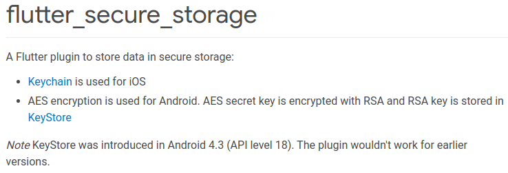

# M2: Insecure Data Storage

>Paradigm Shift: **Security Misconfiguration**

If authentication and authorization is being handled by managed services, the only data that remains to be handled is the specific data collected by the target mobile app.

To allow apps to function in offline mode, certain user data might have to be stored locally, on the mobile device itself. In such a case, sensitive data needs to be stored securely.

## Typical Tests for Insecure Keystore Usage

1. Insecure keystore type in use - **AndroidKeystore** supports hardware-backed containers and should be preferred.
2. Key not invalidated on new fingerprint enrollment
3. Keystore accessible without screen unlock
4. Weak cryptography algorithms in use
5. Weak/hardcoded password for keystore or keystore entry - The AndroidKeystore is the recommended keystore type but if the application design requires the usage of a software backed keystore then setting a strong user-derived password is advised.

**Recommendation:**
Developers must mark the keystore keys as accessible only after:
1. The device has been unlocked.
2. Fingerprint or other biometrics have been validated.

## Implementation of Secure Local Authentication

### Manual Approach: AndroidKeystore
1. Create the Android keystore key with `setUserAuthenticationRequired` and `setInvalidatedByBiometricEnrollment` set to true. Additionally, `setUserAuthenticationValidityDurationSeconds` should be set to -1.
2. Initialize cipher object with keystore key created above.
3. Create `BiometricPrompt.CryptoObject` using cipher object from previous step.
4. Implement `BiometricPrompt.AuthenticationCallback.onAuthenticationSucceeded` callback which will retrieve cipher object from the parameter and USE this cipher object to decrypt some other crucial data such as session key, or a secondary symmetric key which will be used to decrypt application data.
5. Call `BiometricPrompt.authenticate` function with crypto object and callbacks created in steps 3 and 4.

Refer - https://github.com/android/security-samples

## A Flutter Plugin: flutter_secure_storage
Secure Storage for Android (Keystore) & iOS (Keychain)

## References

* https://medium.com/kick-start-fluttering/saving-data-to-local-storage-in-flutter-e20d973d88fa
* https://medium.com/@afegbua/flutter-thursday-13-building-a-user-registration-and-login-process-with-provider-and-external-api-1bb87811fd1d
* https://pub.dev/documentation/flutter_login/latest/
* https://stackoverflow.com/questions/55591958/flutter-firestore-causing-d8-cannot-fit-requested-classes-in-a-single-dex-file
* http://www.lib4dev.in/info/NearHuscarl/flutter_login/208842838
* https://flutter.dev/docs/cookbook/navigation/passing-data
* https://dev.to/adamcyber/flutter-apps-with-aws-amplify-backend-part-2-authentication-5d36
* https://fireship.io/lessons/flutter-file-uploads-cloud-storage/
* https://medium.com/flutter-community/simple-ways-to-pass-to-and-share-data-with-widgets-pages-f8988534bd5b
* https://medium.com/swlh/flutter-apps-with-aws-backend-part-4-storage-74ae2dbdc4b5
* https://www.pinclipart.com/picdir/middle/525-5252646_ninja-turtles-clipart-kawaii-cute-ninja-turtle-drawing.png
* https://carmine.dev/posts/flutterwebjwt/