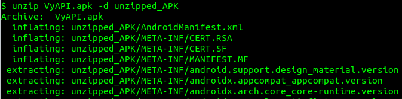
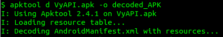
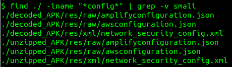
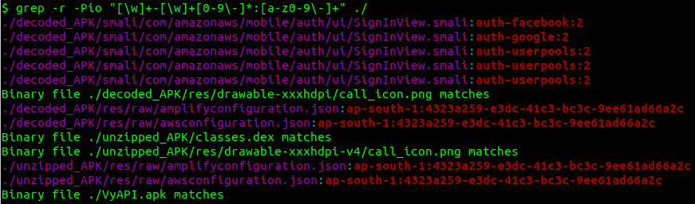

# Hands-On

## Exercise-1: Java

1. **Download** [VyAPI APK](https://drive.google.com/file/d/19FAHvJQprpjJQLYNmWJKL551orgWMTyx/view?usp=sharing)
2. **Unzip** the APK: `unzip VyAPI.apk -d unzipped_APK`

    

3. **Decode** the APK: `apktool d VyAPI.apk -o decoded_APK`

    

4. Do a **keyword search** to locate all **configuration files**: `find ./ -iname "*config*" | grep -v smali`

    

5. Do a pattern search on file contents: `grep -r -Pio "[\w]+-[\w]+[0-9\-]*:[a-z0-9\-]+" ./`

    

    Note: Above example uses [regular expression](https://www.w3schools.com/jsref/jsref_regexp_wordchar.asp) to perform a pattern search.

6. Find the **Amazon Cognito Identity Pool ID**.
7. Check if an unauthenticated user can access any of the sensitive AWS services. If stuck, [follow the steps mentioned here](https://github.com/riddhi-shree/knowledge-sharing/blob/master/Mobile/Android/amazon_cognito_authz_issue/README.md). 

## Exercise-2: Javascript

1. Download [Winja2020 APK](https://drive.google.com/file/d/1AW4VC8KRONbfiCwAqwWJvtmQtpT5YEBB/view?usp=sharing)
2. Find the hidden secrets

# Exercise-3: Dart

1. Download [Flutter Android APK](https://drive.google.com/file/d/1qLbZKuxLOn5CrUOYufIRMtFGioWdSHUd/view?usp=sharing)
2. Find the hidden secrets

## Download inks:

* https://drive.google.com/file/d/19FAHvJQprpjJQLYNmWJKL551orgWMTyx/view?usp=sharing
* https://drive.google.com/file/d/1AW4VC8KRONbfiCwAqwWJvtmQtpT5YEBB/view?usp=sharing
* https://drive.google.com/file/d/1qLbZKuxLOn5CrUOYufIRMtFGioWdSHUd/view?usp=sharing
