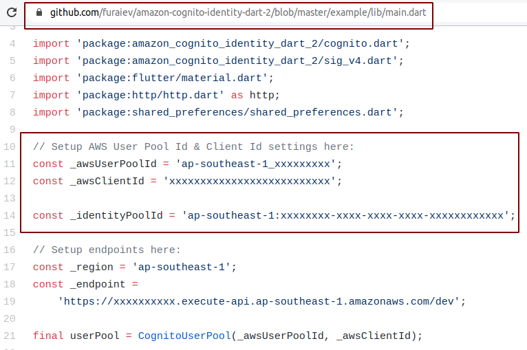
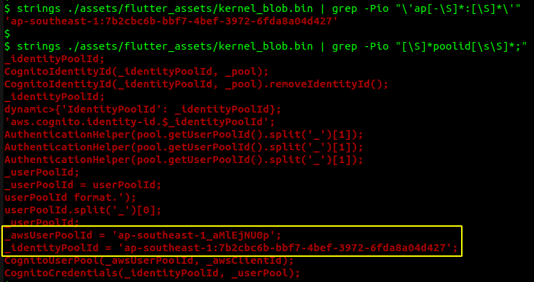
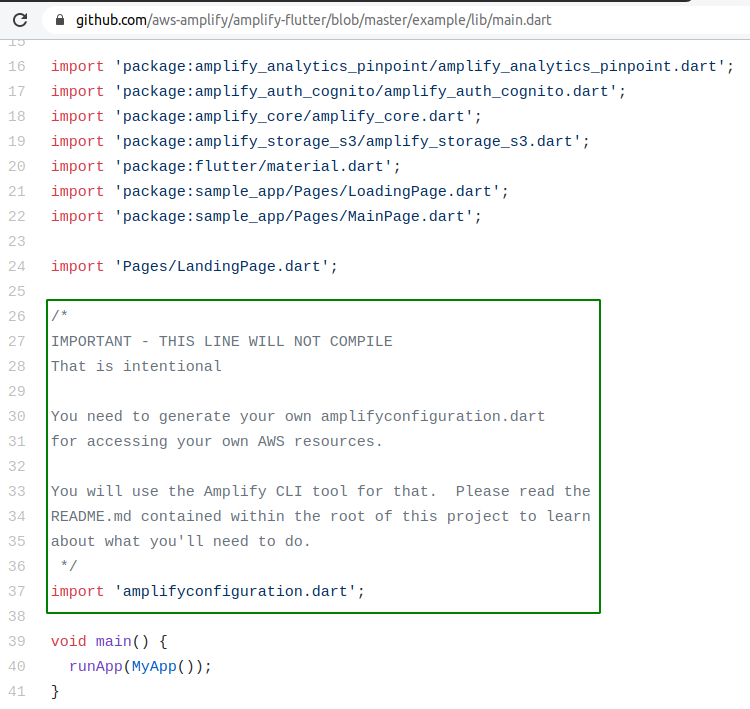
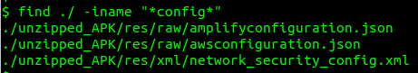
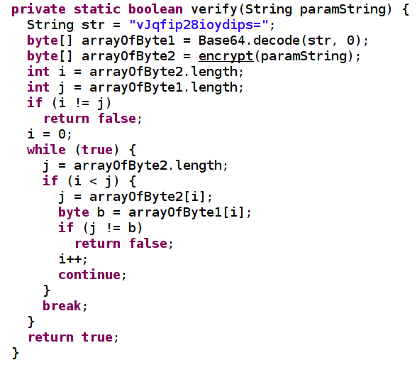

# M9: Reverse Engineering

>Paradigm Shift: **Change of Perspective**

## What are we looking for?

1. **Hardcoded Secrets**

    * Someone following the (insecure) example mentioned in [this GitHub repo](https://github.com/furaiev/amazon-cognito-identity-dart-2) would probably end up hardcoding sensitive details into the source code.

        

    * Hardcoded secrets can be extracted with little effort

        

    * A **better way** to consume Amazon Cognito services is mentioned in the [official Amplify Flutter repository](https://github.com/aws-amplify/amplify-flutter/blob/master/example/lib/main.dart)

        

2. **Bundled Configuration Files**

    Configuration files containing sensitive data can be obtained from the unzipped and/or decoded APK.
  
    

3. **Application Logic**

    Reverse engineering not only facilitates the extraction of hardcoded secrets but it also also helps in understanding the business logic (that could potentially be bypassed).

    ---

    